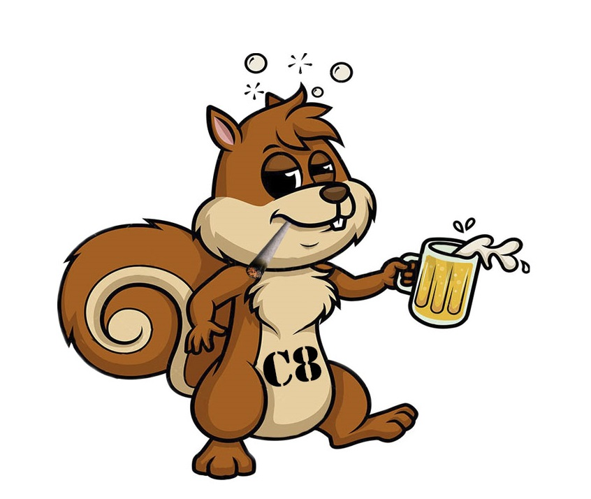
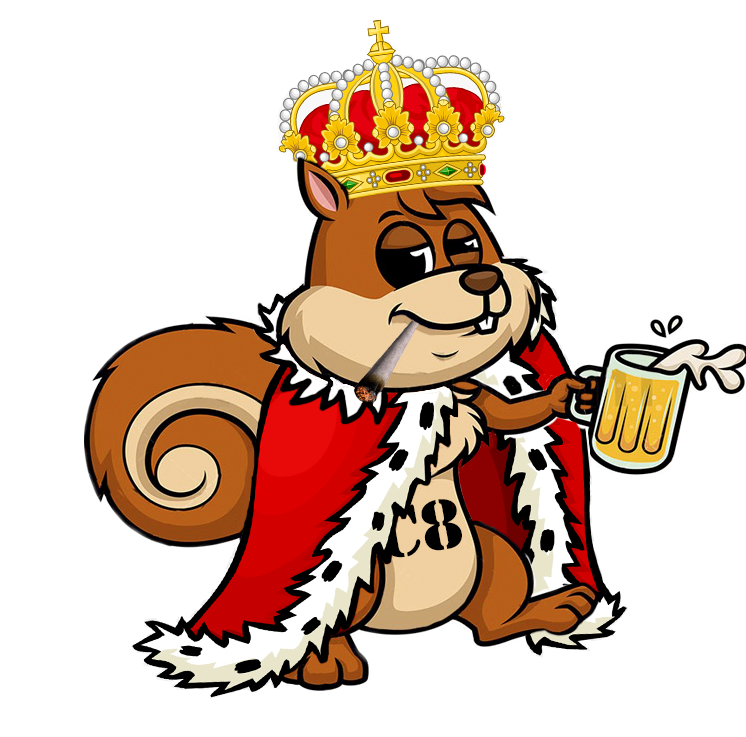

# C8 BOT



Discord botti. MVP announcementtii ja muut random paskaa

## How to run

### Requirements
* Node 14.x: recommend [nvm](https://github.com/nvm-sh/nvm) on linux and macOS

### Optional requirements

Optional requirements for better performance of the bot.

* Python: `brew install python`/`sudo apt install python`
* Make: `brew install make`/`sudo apt install make`
* GCC: `brew install gcc`/`sudo apt install gcc`
* G++: `brew install g++`/`sudo apt install g++`

### Configure and run 

Copy environment variable configuration template `env.dist` to actual config
file `.env` and fill values.

```bash
# Install dependencies with npm
npm install

# Copy environment variable configuration template to actual config file
cp .env.dist .env
# Add required .env 
$EDITOR .env

# Run dev server with auto-reload on changes
npm run dev
```

## Deploy

The app is deployed to [Heroku](https://heroku.com) on every push to `main`.
[Find the control panel here](https://dashboard.heroku.com/apps/c8-bot)

To manually deploy:
* [Install Heroku CLI](https://devcenter.heroku.com/articles/heroku-cli)
* `heroku login`
* `heroku git:remote -a c8-bot`
* `git push heroku main`

## The boring stuff

All rights reserved to the relevant contributors. No license granted. Fuck off.

### Creators

> Tapppi  
  Gee  
  Snakkeboi  
  Zerosku  


